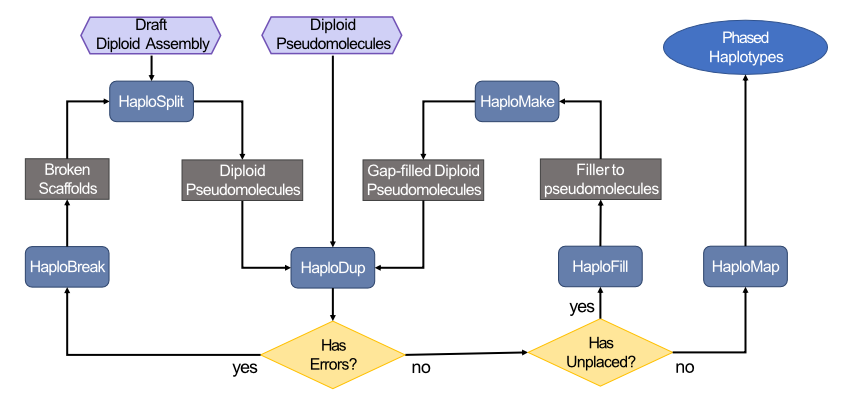

# HaploSync - Ver. 1.0
Tools for haplotype-wise reconstruction of pseudomolecules

## Aim
The aim of the tool is improving continuity of a given genome draft assembly up to pseudomolecule representation using a closely relate species as guide to sort and direct the query sequences.  

HaploSync was developed to improve the quality of diploid genome assemblies. This tool:

* builds diploid pseudomolecule assemblies from draft sequences using a reference genome as a guide,
* enhances assembly contiguity,
* fills sequence gaps by comparing haplotypes independent of a reference,
* generates maps of the phased haplotypes,
* assesses the quality of assembled sequences, and
* edits sequences.

## Resources
  * [Go to manual](./manual/Readme.md)
  * [Go to installation](./manual/Install.md)

## Cite:
### Pre-print:
__Assembly of complete diploid phased chromosomes from draft genome sequences__\
Andrea Minio, Noé Cochetel, Amanda M Vondras, Mélanie Massonnet, Dario Cantu;\
bioRxiv 2021.11.11.468134; doi: https://doi.org/10.1101/2021.11.11.468134

