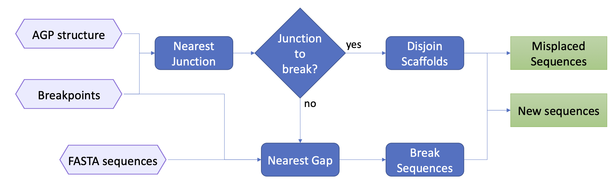

# HaploBreak

HaploBreak corrects chimeric scaffolds by automatically searching for and breaking gaps (stretches of Ns) or appropriate junctions. HaploBreak uses a sequence fasta, a list of breakpoints, and an optional AGP and/or annotation to accomplish this.

## Usage

```
usage: HaploBreak.py [-h] [-f genome.fasta] [-b breakpoints.tsv] [-o outname]
                     [-p new] [-g annotation.gff3]
                     [-a previous_to_actual.genome.agp] [--bed annotation.bed]
                     [-d 25000] [-m 200] [--allow_annotation_breaking]
```

## Input and Arguments

#### Mandatory

* `-f | --fasta genome.fasta`: Genome sequence. FASTA format, unmasked or soft-masked. **Do not hard-mask the input sequence. HaploBreak recognizes Ns as gaps**.

* `-b | --breakpoints breakpoints.tsv`: Breakpoints file. A tabular file. The first column contains the ID of the sequence to break and the second column contains a comma-separated list.

  * Breakpoint coordinates given as input are not necessarily precise. HaploBreak will search for a _junction_ to associate with a _breakpoint_ within a particular range. The `-d | --distance` parameter controls this range.

  * `START` or `BEGIN` indicates the beginning of the sequence. `END` or `STOP` indicates the end of the sequence. Case is insensitive.
  
  * ex: 
  
    ```text
    chr01	14110000-14330000,12150000-12940000
    chr02	16540000-18300000,11880000-13580000
    chr03	7330000-13380000
    chr04	11140000-END
    chr07	START-7130000
    ```

#### Optional

* `-g | --gff3 annotation.gff3`: Genome annotation in GFF3 format.
* `-a | --agp previous_to_actual.genome.agp`: AGP file defining the coordinates of legacy sequences composing the input assembly. [AGP file format description](https://www.ncbi.nlm.nih.gov/assembly/agp/AGP_Specification/)
* `--bed annotation.bed`: Region annotation in BED format. 
  * BED3 and BED6 formats are accepted. Additional columns will be considered an annotation and reported unedited.
* `-o | --out outname`: Prefix for output file.
  * Default: `out`
* `-p | --prefix new`: Prefix for new sequence names that will be added before the old name. Leave unset to keep the same names.
  * Default: NONE.
* `-d | --distance 25000`: Maximum distance (in bp) allowed to search for junctions that correspond to breakpoints. If no junction can be found in this range, breakable gaps are sought in the FASTA.
  * Default: `25,000.`
* `-m | --minimum 200`: Minimum gap size (bp) in FASTA to consider for junction selection.
  * Default: `200.`
* `—allow_annotation_breaking`: Allow breaking annotated genes if a GFF3 is provided.

## Output

* `out.new_legacy.agp`: AGP file reporting the relationship between processed sequences (`out.new_legacy.fasta`) and legacy sequence structure. 

* `out.new_legacy.fasta`: processed sequences.

* `out.blacklist.txt`: sequences between two AGP-reported gaps used as junctions or gaps.

  * this file will be always created but is empty if no sequence is blacklisted.

* `out.breakable_gaps.list.txt`: list of input in-sequence gaps suitable for breaking.

* `out.broken_gaps.given_sequences.list.txt`: a list of junctions / gaps identified in the input sequence. The format reports:

    * *Header*: “>” and the name of the input.

    * *Regions*: a tabular description of each region to search for junctions and gaps. The first column indicates whether the breakpoint junction falls in a known gap (from the AGP file if given) or was outside of the range defined in `--distance` and searched for gaps. Columns 2 and 3 are the coordinates of the region.

  * Ex: 

    ```text
    >chr01
    sequence        12150000        12857650
    sequence        14110000        20989345
    gap     12957818        12958818
    sequence        14330000        20989345
    >chr02
    sequence        13580000        18271468
    gap     18271468        18272468
    ```

* `out.broken_gaps.legacy_sequences.list.txt`: list of the broken gaps in terms of the legacy sequences ids (if AGP is given). The format is the same as `out.broken_gaps.given_sequences.list.txt`, but only broken gaps are reported.

* `out.broken_loci.annotation.legacy_updated.txt`: Loci that were overlapping AGP-reported gaps and broken during junction selection.

* `out.legacy_breakable_gaps.list.txt`: list of legacy in-sequence and breakable gaps.

* If GFF3 and/or a BED files are given, an annotation is reported in separate files with translated coordinates in terms of the updated legacy sequences.

  * `out.new_legacy.annotation.gff3`
  * `out.new.annotation.gff3`
  * `out.new_legacy.bed`
  * `out.new.bed`

## How it works

* Small islets of nucleotides dispersed in the gaps, like the 6 bp digestions sites in BioNano hybrid scaffolds, are converted to Ns.

* If no AGP file is submitted, gaps (stretches of Ns) are automatically sought in the input or "legacy" sequence. HaploBreak searches for a valid gap closest to a given breakpoint to split the sequences.

* If an AGP file describing the scaffold or sequence structure is used, scaffold junctions reported in the AGP file are prioritized for breakpoint junction selection. For a given breakpoint: 
	1. If a junction is associated with a breakpoint, then legacy sequences are broken at the junction.
	2. If no junction is associated with a breakpoint, legacy sequences are searched for gaps closest to the breakpoint and broken.

* Breakpoints occur in pairs, so are associated with two different junctions or gaps.
	1. If one or both breakpoints leads to a gap in the input sequence, the corresponding legacy sequence is broken on the associated gap(s) and the newly generated parts are renamed. This information can help resolve scaffolding or HaploSplit-driven chimeric junctions that lead to duplicated sequences. After the break, Haplosplit handles each part independently.
	2. If a pair of breakpoints are associated with two distinct AGP junctions (or an AGP junction and an end of an input sequence), all of the legacy sequences between them in the AGP file are classified as “unwanted” for the tiling path in `out.blacklist.txt`. This is expected at scaffolding or HaploSync-driven chimeric junctions that lead to duplicated sequences.

  
