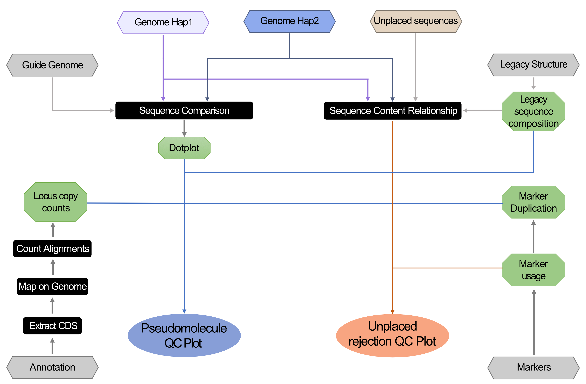
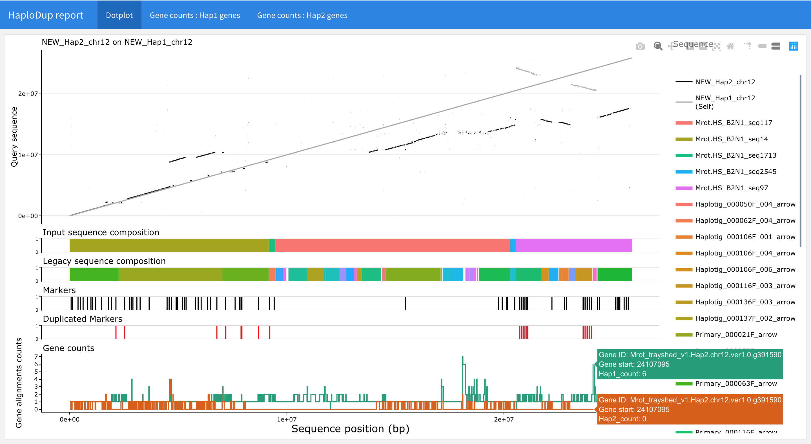
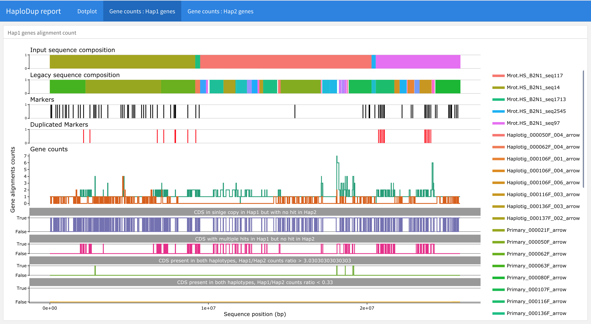
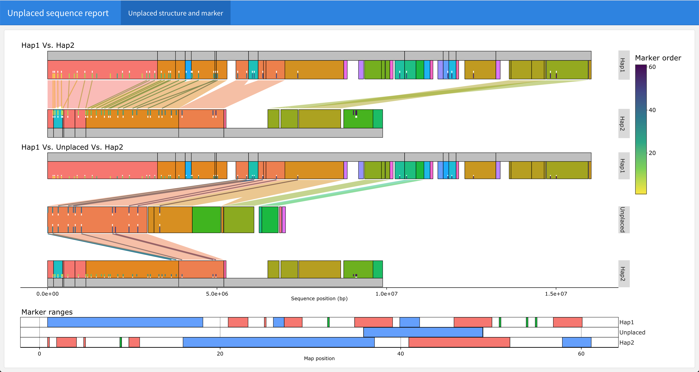

# HaploDup

HaploDup compares the gene content of two haplotypes, delivers interactive graphs, and identifies chimeric scaffolding where alternative haplotypes are included in the same pseudomolecule.

```
usage: HaploDup.py [-h] [-f genome.fasta [Required]]
                   [-g annotation.gff3 [Required]]
                   [-a functional_annotation.txt] [-c Hap1_to_Hap2.txt]
                   [-b markers.bed] [--markers_map markers_list]
                   [--agp structure.agp] [--input_groups input_groups.tsv]
                   [--legacy_agp legacy_structure.agp]
                   [--legacy_groups legacy_groups.tsv]
                   [--rejected_list rejected.list] [-o NAME]
                   [--hit_identity N] [--hit_coverage N] [--gene_identity N]
                   [--gene_coverage N] [--unbalanced_ratio N]
                   [-r reference.fasta] [--reuse_mappings] [--reuse_dotplots]
                   [--reuse_gmap] [--skip_dotplots_by_chr] [-t N]
                   [--feature [CDS|mRNA]] [-w N] [--allowed N]
```

## Input and Arguments

#### Mandatory

   * `-f | --fasta genome.fasta`: A FASTA file of pseudomolecule sequences. A comma-separated list of files can be provided if the sequences are in more than one file. The sequences produced by HaploSync, for example, are split by haplotype.
     
   * `-g | --gff annotation.gff3`: The gene annotation for the pseudomolecules in GFF3 format. A comma-separated list of annotation files can be provided if the annotation is in multiple files.
     
   * `-c | --correspondence Hap1_to_Hap2.txt`: Tab-delimited text file(s) of sequence names relating haplotypes and, if present, the reference genome.
     
        * Columns: 
          
          1. Chromosome ID
          2. Haplotype 1 IDs
          3. Haplotype 2 IDs 
          4. [Reference id, only if used]
          
        * Ex. `Hap1_to_Hap2.txt`:
     
          ```text
          Chr01	Hap1_chr01   Hap2_chr01 Ref_chr01
          Chr02	Hap1_chr02   Hap2_chr02	Ref_chr02
          								[...]
          ChrNN	Hap1_chrNN   Hap2_chrNN Ref_chrNN
          ```

#### Optional

* `-o | --out NAME`: Output file prefix. 
  
  * default: `out`.
  
* `-t | --threads N`: Cores used in the mapping process.
  
  * default: `4`.
  
* `-r | --reference reference.fasta`: FASTA file(s) of reference genome sequences (haploid)

* `-a | --annotation functional_annotation.txt`: Text file with the functional annotation of each transcript or gene

* `-b | --markers_bed markers.bed`: Marker positions on input sequences

* `--markers_map markers_list`: Table of genomic map markers with sorting order information. The table does not need to be sorted, but should contain information regarding the order of the markers in the map.

  * Tab-delimited file with 3 columns:
    1. Chromosome ID
    2. Marker position
    3. Marker ID

* `--agp structure.agp`: AGP structure of input sequences

* `--legacy_agp legacy_structure.agp`: AGP structure of input sequences based on legacy sequences

* `--rejected_list rejected.list`: A list of unplaced sequences associated with a chromosome but rejected from the tiling path

  * A tab-delimited file reporting 
    1. Unplaced sequence ID
    2. Associated pseudomolecule (either Haplotype1 or Haplotype2 sequence ID)
    3. Expected Orientation
  * Setting this parameter will run QC of unplaced sequences versus the associated chromosome pseudomolecules. The relationships between input sequence structures can be set with:

* `--legacy_groups legacy_groups.tsv`:  A tab-delimited file associating the input sequences composing legacy groups. This should contain one column reporting the component ID and another column naming the group it belongs to. A sequence can be associated with multiple groups in multiple rows. 

* `--input_groups input_groups.tsv`: A tab-delimited file describing groups of input sequences. It will be used to trace sequence relationships if `—legacy_groups` is not set. The file should contain one column reporting the sequence ID and another for each sequence's group ID. A sequence can be associated with multiple groups in multiple rows. 

* `--hit_identity N`: Mimimum genome mapping hit identity 

  * default: `90`

* `--hit_coverage N`: Mimimum genome mapping hit length 

  * default: `3000`

* `--gene_identity N`: Mimimum gene mapping identity 

  * default: `95`

* `--gene_coverage N`: Mimimum gene mapping coverage 

  * default: `95`

* `--feature [CDS|mRNA]`: If a GFF is used, use this feature type for mapping.
  * Choice of CDS or mRNA 
  * default: `CDS`
  
* `-w | --window N`: Window size (number of genes) to search for blocks of genes with unbalanced allele counts. 
  * 0 disables search 
  * default: `10`
  
* `--allowed N`: Allowed number of unbalanced genes per window. 
  
  * default: `5`
  
* `--unbalanced_ratio N`: Gene count ratio between haplotypes to call the locus unbalanced
  
  * values range: [0-1]
  * default: `0.33`
  
* `--reuse_mappings`: If set, alignments present in the output folder are reused and not overwritten by performing alignments again 

  * Default: overwrite

* `--reuse_dotplots`: If set, dotplots present in the output folder are reused and not overwritten

  * Default: overwrite

* `--reuse_gmap`: If set, CDS mappings with GMAP are reused and not overwritten by redoing the analysis

  * Default: overwrite

* `--skip_dotplots_by_chr`: If set, prevents the production of dotplots comparing each chromosome sequence to each other chromosome sequence. A whole genome dotplot is produced. 

  * Default: overwrite


##  Output

* `${NAME}.dedup_dir`: Results of HaploDup analysis for the newly produced pseudomolecules. It contains:
  * `index.html`: This file can be opened in a web-browser to navigate all report files.
  * See [Pseudomolecules QC report](../Workflows/pseudomolecule_QC.md#2.3.1---Pseudomolecules-QC-report)
  * Other useful intermediate files and folders:
    * `${NAME}.ref.fasta`: pseudomolecules sequences.
    * `gmap_index/`, `gmap_index.log`, `gmap_index.err`: GMAP index folder, indexing procedure standard log and standard error.
    * `CDS.on.hap1.gmap.gff3`, `CDS.on.hap2.gmap.gff3`: alignments of CDS or mRNA sequences on the genome
    * `diploid_gene_count_trace.hap1.txt`, `diploid_gene_count_trace.hap2.txt`: Tables with hit counts of each gene annotated on the two haplotypes. The columns are:
      1. Chromosome ID
      2. Locus start
      3. Locus end
      4. Locus ID
      5. Hap1 counts
      6. Hap2 counts
      7. Locus functional annotation
      8. Number of genes with the given functional description(s) across all annotated genes
    * `${NAME}.hotspots.windows.hap1.txt `, `${NAME}.hotspots.windows.hap1.txt` : Windows on the genome showing hotspots of unbalanced genes between haplotypes
      * `-w | --window N`, `-r | --ratio N`, and `--allowed N` parameters control the behaviour of the search
    * `diploid_gene_count_trace.hap1.rda`, `diploid_gene_count_trace.hap2.rda`: RDA files produced by R that create the plots from trace counts
* `${NAME}.structure_comparison`: If `--rejected_list` is given, this folder will contain the reports from the comparison of unplaced sequences 
  * `index.rejected_sequences.html`: This file can be opened in a web-browser to navigate report files
  * See [Unplaced sequence rejection QC report](../Workflows/pseudomolecule_QC.md#2.3.2---Unplaced-sequence-rejection-QC-report)

## How it works

HaploDup does the following procedure:

* Dotplots compare pseudomolecules and a guide/reference haploid genome
* CDS sequences are extracted from the input annotation of both haplotypes
  	1. 	Map the CDS on both haplotypes
   	2. 	Count the alignments of each CDS on each pseudomolecule for both haplotypes
   	3. 	Compare the counts of the CDS alignments for each haplotype's pseudomolecules
   	4. 	Produce an interactive plot for each pseudomolecule to analyze differences in hit counts for each annotated gene

* Count the markers found in each sequence
* Relate marker positions in each sequence to the pseudomolecules or unplaced sequences
* Relate the sequences and legacy structure to their positions in the pseudomolecules or unplaced sequences




## Plots

### Pseudomolecules QC report

Plots can be viewed in a web browser using `${NAME}.dedup_dir/index.html`. Reports include interactive HTML plots and single PDF and PNG plots. The report will contain:

* An alignment of the query sequence on the target sequence, super-imposed on the alignment of the target pseudomolecule on itself
* The target sequence structure, with two lines of sequences at most
* Marker position and duplication status
* Gene mapping count on both haplotypes
* Unbalanced gene mapping count between haplotypes





### Unplaced sequence rejection QC report

Reports can be viewed as interactive HTML plots or in individual PDF or PNG pages from `${NAME}.structure_comparison/index.rejected_sequences.html`

Plot content depends on input. Generally, the report contains:

* A comparison of associated pseudomolecules structures in terms of markers and sequence content. The plot can show two levels of structural information (ex. scaffolds and the contigs that compose them).
* Comparison of the unplaced sequence with the associated pseudomolecules in terms of markers and sequence content. The plot can show two levels of structural information (ex. scaffolds input to HaploSplit, and the legacy contigs that compose them).
* Marker content usage comparison


