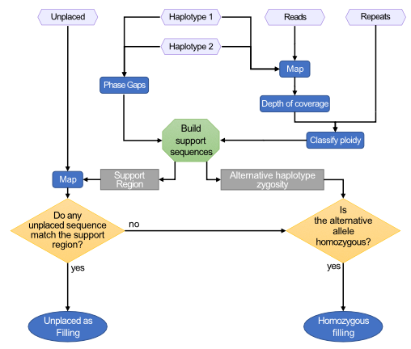

# HaploFill

HaploFill uses unplaced sequences to fill haplotype-specific gaps produced during the assembly or pseudomolecule reconstruction procedures. When gaps in diploid regions cannot be filled with unplaced sequences, the alternative haplotype is used to fill the unassembled region.

## Usage

```
usage: HaploFill.py [-h] [-1 Hap1.fasta] [-2 Hap2.fasta] [-U Unplaced.fasta]
                    [-c Hap1_to_Hap2.txt] [--exclusion exclusion_list.tsv]
                    [--known known.tsv] [-r repeats.bed]
                    [--repeats_format [BED|GFF3|GFF|GTF]] [-o outprefix]
                    [--C12 cov1.txt] [--C1 cov1.txt] [--C2 cov2.txt] [-C]
                    [-s reads.fastq.gz] [--map_threads N]
                    [--sequencing_technology [PacBio|ONT|Illumina_pe|Illumina_se]]
                    [--b1 reads.on.hap1.bam] [--b2 reads.on.hap2.bam] [-e 100]
                    [-t path/to/tmp] [--resume N] [--stop N] [--overwrite]
                    [--flanking N]
```


## Input and Arguments

#### Mandatory

   * `-1 | --hap1 `: FASTA sequences of the first haplotype.
   * `-2 | --hap2`: FASTA sequences of the second haplotype.
   * `-U | —unplaced`: FASTA sequences of the unplaced sequences.
   * `-c | --haplotype_correspondence`: Tabular text file that relates sequences between the two haplotypes.
   * `-r | --repeats`: `BED`, `GFF3`, `GFF`, or `GTF` annotation file of repetitive sequences.

#### Required

One set of parameters is required for coverage analysis:
* Read coverage per base:
  * Single file with both haplotypes.
    * `--C12 | --Coverage12`
  * Separate files for each haplotype.
    * `--C1 | --Coverage1` , `--C2 | --Coverage2` 
*  Map and calculate coverage:
  *  `-C | --calculate_coverage`, `-s | --sequenced_reads` 
* Calculate coverage from alignments:
  *  `-C | --calculate_coverage`, `--b1` , `--b2` 

Flag definitions:
* `--C12 | --Coverage12`: Per base sequencing coverage of both haplotypes
  * obtained with: `bedtools genomecov -d -ibam`
* `--C1 | —Coverage1`: Per base sequencing coverage of haplotype 1
  * obtained with: `bedtools genomecov -d -ibam`
* `--C2 | —Coverage2`: Per base sequencing coverage of haplotype 2
  * obtained with: `bedtools genomecov -d -ibam`
* `-C | --calculate_coverage`: If set, run coverage calculation
  * default: false
* `-s | —sequenced_reads`: sequenced reads in FASTA or FASTQ format. Gzipped (.gz) files are permitted
* `--b1`: alignment of reads on the first haplotype in BAM format
* `--b2`: alignment of reads on the second haplotype in BAM format

#### Optional

   * `—repeats_format`:  Repeat annotation file in `BED`, `GFF3`, `GFF` or `GTF` format
                               * Default: `BED`
 * `--exclusion` : Tab separated values file of unplaced sequences incompatible with a given input pseudomolecule
 * `--known known.tsv`: Tab separated values file of unplaced sequences with known pseudomolecule association
* `-o | --output`: Prefix for the names of output files
                            * Default: `out`,
* `--sequencing_technology`:  Sequencing technology used for generating reads in `-s`
        * Default: `PacBio`.
     * Allowed technologies:
                          * `PacBio`: PacBio subreads
                       * `ONT`: Oxford NanoPore reads
                       * `Illumina_pe`: Illumina short reads Paired-End sequencing protocol
                       * `Illumina_se`: Illumina short reads Single-End sequencing protocol
* `--map_threads`: Number of threads to run mapping with
        * Default: `4`
* `-e | —expected_coverage`: Expected coverage threshold to evaluate local ploidy. If not set, median value is calculated and used
         * Default: median
* `-t | --temp`: Path to temp folder. **Required for resuming a process**
         * Default: `./tmp_HaploFill`
* `--resume`: Resume processing at step
        * 1 to 6
* `--stop`: Stop processing at step
        * 1 to 5
* `--overwrite`: Overwrite content in the temporary folder
* `--flanking`: Size of the region flanking gaps
     * Default: `150000` (150Kb)

## Workflow control

HaploFill may take a long time to run. The user can control each step of the procedure and recover data from each step.

* Steps already completed successfully are skipped by the pipeline:

   * `--resume` and `--stop` flags can be used to select from which step to start processing and select at which step to stop the procedure, respectively. Processing can be resumed after a stop and recover after a crash.
 * Some steps like the alignment and coverage calculation are performed with external tools. This can run separately and its result can be passed directly to the tool. If run by HaploFill, the results are conserved in a temporary folder (Default: `./tmp_HaploFill`) and can be recollected.
 * To recover the procedure, HaploFill needs access to the temporary folder. If the previous run used a custom temporary folder set with `-t | --temp`, you need to provide it again to the tool. The temporary folder contains the intermediate files and control file, `status.json`. The control file is used by the tool to keep track of successfully completed steps; these steps can be skipped if the tool is re-run. This gives finer control of the steps.
 
 * Here is an example of `status.json`:

     ```yaml
     {
      "1-setup": {
          "1.1-split": "DONE",
          "1.2-pairs": "DONE",
          "1.3-repeat": "DONE",
          "1.4-gap": "DONE"
      },
      "2-coverage": {
          "2.1-map1": "TODO",
          "2.2-map2": "TODO",
          "2.3-cov1": "TODO",
          "2.4-cov2": "TODO",
          "2.5-split": "TODO"
      },
      "3-ploidy": {
          "3.1-median": "TODO",
          "3.2-categorize": "TODO"
      },
      "4-hap2hap": {
          "4.1-map": "TODO",
          "4.2-uniquify": "TODO",
          "4.3-pairing": "TODO"
      },
      "5-upgradeable": {
          "5.1-Unmatched": "TODO",
          "5.2-preprocess_gaps": "TODO",
          "5.3-get_sequences": "TODO"
      },
      "6-filling": {
          "6.1-gather": "TODO",
          "6.2-map": "TODO",
          "6.3-select": "TODO"
      }
     }
     ```

    * It is a text file in `json ` format and simple to edit. It contains information on the status of each sub-step that HaploFill performs. 
       * If the step has yet to be run, it reports `TODO`.
       * if the step have been completed successfully it will report `DONE`.
    * By editing the status in `TODO`, the user can override the procedure and force to re-run a given step of the pipeline. 
      
       * Rerunning all downstream steps is recommended to avoid miscalculations.

## Output

* Standard output: Will log the status of the procedure with time information.
* Standard error: Will detail the processes running and summarise some of the results obtained for QC and debugging.
* `tmp_HaploFill`: This folder will contain all the temporary data of the analysis and that which is necessary for recovering the procedure and controlling re-runs (see [usage page](../Usage/HaploFill_usage.md#haplofill) for more details).
* `out.gap_filling_findings.txt`: Summary of the results obtained for each gap in the sequence.
* `out.structure.block`: [BLOCK](../block_format.md) file format of the expected pseudomolecules' structure after gap filling.

## How it works

Generally, pseudomolecules are the result of scaffolding or the juxtaposition of sequences. These procedures leave gaps in sequence that require filling to recover lost or missing information. Gaps present in the pseudomolecules produced by HaploSplit can have two different origins:

* **Placeholders between legacy sequences**: HaploSplit adds gaps where unknown content expected between adjacent sequences. These gaps are a user-defined fixed length.

* **Gaps due to previous assembly procedures**: Gaps in the legacy sequences used as input for HaploSplit are inherited in final pseudomolecules unless the gaps are broken by HaploBreak. Gap lengths may vary based on the approach used for scaffolding.

The filling procedure considers gap characteristics because the nature of the missing information, the gap, is non-uniform.

* **Repetitive content**
  * Short reads, like those produced by Illumina sequencing, are not well-suited to reconstructing repetitive elements. When attempted, repetitive elements tend to collapse into a single representative and the assembly is fragmented. Scaffolding can reduce fragmentation, but generally cannot fill in lost information between joined sequences.
  * Filling repetitive regions is impractical and error-prone. Generally, a consensus representation of repetitive sequences is assembled or repetitive regions are included in separate contigs. Correctly placing repeats in gaps is challenging because the consensus sequence cannot be rejected and because of ambiguity in the assembly graph.
  
* **Placeholder sequences information**
  * Hybrid scaffolding procedures applied to sequences generated by BioNano technology can produce large gaps due to an inability to use all available information. Optical maps are made by relating optically captured markers with in-silico digested enzyme restriction sites. When the number of markers in a sequence are insufficient to uniquely place that sequence, a long gap is left instead.
  
  * The alternative haplotype and regions that flank gaps can be used to help retrieve missing information that caused unplaced sequences. 
    * HaploSplit inherits gaps and is unable to fill them. Placing a gapped sequence in the tiling path prevents gap-filling. So, sequences that would serve as “filler” remain unplaced.
    * Two haplotypes do not reliably have the same amount and pattern of fragmentation, but comparisons between them can be used to correctly identify filler among unplaced sequences.

* **Haploid representation of homozygous sequences**
  * Unzipping a Falcon or other diploid-aware assembly identifies alternative haplotype structures in divergent genomic regions. FalconUnzip calls alternative structures haplotigs. Generally, these are much shorter than the primary sequence they are associated with. This is because the homozygous regions are not represented in haplotigs. For genomes with low heterozygosity, there are tools available that “fill” the haplotigs with homozygous information. 
  * When heterozygosity or the degree of divergence between haplotypes is high, FalconUnzip cannot distinguish the haplotypes; this results in the overestimation of the primary sequence that makes filling the haplotigs with homozygous information unreliable.
  * Gaps in either haplotype associated with homozygous regions can be filled using the alternative allele.

* **Unmatched information in the reference**
  * HaploSplit uses reference information to bin sequences belonging to the syntenic pseudomolecules. However, divergent regions between haplotypes will not be paired. 
  * If a divergent region is connected to a syntenic one because it is in the same contig or scaffold, HaploSplit will correctly place it in the pseudomolecule. Without positional information, it will remain unplaced.
  * The alternative pseudomolecules for each chromosome are made of alternative haplotypes sequences. They do not necessarily share the same structure and sequence content because they are assembled and scaffolded independently. A direct comparison of the two pseudomolecules can recover the divergent structure in one haplotype from the alternative haplotype, provided that HaploSplit has the requisite positional information to do so.

HaploFill searches for the best sequences to fill gaps.



### HaploFill Procedure	

1. Determine the nature of each gap:

   1. Calculate the sequencing coverage of each pseudomolecule.	
      * **If only reads are available:** aligns the reads and analyses the mappings to extract the per base coverage depth.
      * **If mapping results are already available**: `BAM` file(s) are processed and per base coverage depth is calculated.	
      * **If per base coverage depth is available**: Results are directly imported.

   2.  Evaluate the ploidy/repetitivity status of each pseudomolecule region:	
      * Read the repeat annotation.
      * Smooth the depth of coverage.	
      * Classify each region of the genome based on the expected haploid depth of coverage:	
        * Load repeat annotation.
        * Haploid depth of coverage thresholds can be given by the user or calculated based on the median depth (suggested):
          * coverage  ≤ (median cov * 0.1) : Uncovered.
          * (median cov * 0.1) < coverage  ≤ (median cov * 0.6) : Haploid.	
          * (median cov * 0.6) < coverage  <  (median cov * 2.4)  : Diploid.	
          * coverage  ≥  (median cov * 2.4)  : Repetitive/too high.

   3. For each gap, identify the corresponding region on the alternative haplotype:	
      * Extract the sequences and the ploidy for:
        * The regions flanking a gap (upstream and downstream)
        * The region opposite a gap on the alternative haplotype
        * The regions flanking (upstream and downstream) a gap on the alternative haplotype
      * Classify the ploidy of each region.
        * Discard regions that are unreliable for mapping support:	
          * Sequence made >75% of gap
          * Sequence made >75% of repeats/too high coverage
          * Sequence made >75% of gaps or repeats/too high coverage
      * Build support sequences with which to search filling.
        * If the region opposite the gap on the alternative haplotype region is reliable:	
          * a hybrid support region is built. This includes (1) the regions flanking the gap (upstream and downstream) and (2) the region opposite the gap on the alternative haplotype.
          * an alternative support region is built. This includes (1) the region opposite the gap on the alternative haplotype and (2) the regions upstream and downtream of the region opposite the gap on the alternative haplotype.
        * If the region opposite the gap on the alternative haplotype is not reliable:	
          * a gap support region is built. This includes regions flanking the gap.
          
          * an alternative support region is built. This includes the regions upstream and downtream of the region opposite the gap on the alternative haplotype.
          
          
2. Map unplaced sequences on all support regions and find best match to each support region.

3. Validate matches and keep best filler according to the following priority:	
   * hybrid support region filler.
   * alternative support region filler.	
   * gap support region filler.

4. Homozygous filler for unpatched gaps: 	
   * If no filler validates and the region corresponding to the gap on the alternative haplotype is diploid, then report the region as filler, else leave the gap.

