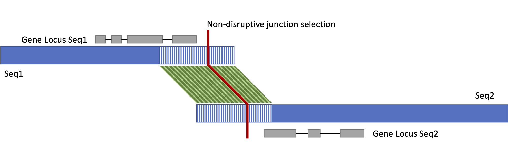

# HaploMake

HaploMake produces novel sequences and translates their annotation. It can also translate coordinates for feature or structure annotations in GFF3, BED or AGP format.

```
usage: HaploMake.py [-h] [-f genome.fasta [Required]] [-s structure.txt]
                    [--format [BLOCK|AGP|BED]] [-o outname] [-p new]
                    [-g annotation.gff3] [-b annotation.bed]
                    [-a previous_to_actual.genome.agp] [--skipoverlap]
                    [--gap N] [--spacer N] [--ignoreids] [--reverse] [-u]
                    [--noagp] [--noprint]                  
```

## Input and Arguments

#### Mandatory

* `-f | --fasta`: Legacy genomic sequences in FASTA format. Can be unmasked or soft-masked, but **cannot be hard-masked with Ns**.
  * Separate files can be provided as a comma-separated list.
* `-s | --structure `: File describing how the novel sequences are generated using legacy sequences. 
  * Separate files can be provided as a comma-separated list.
  * The file formats accepted are:
    * `BLOCK`: See [this page for further informations](../block_format.md).
    * `AGP`: AGP format. See the [AGP file format specifications](https://www.ncbi.nlm.nih.gov/assembly/agp/AGP_Specification/) for more specifications.
    * `BED`: BED format of selected genomic regions. See the [BED file format specifications](https://m.ensembl.org/info/website/upload/bed.html).
      * Each file is treated as the structure of a single new sequence.
      * Output sequence IDs will consist of a `-p|--prefix` and a numeric ID consistent with the order of input BED files.

#### Optional

* `--format`: format of the structure file.
  
  * Valid values are `BLOCK` `AGP` `BED`.
  * Default: `BLOCK`.
  
* `-o | --out `: Output file name prefix.
  
  * Default: `out`.
  
* `-p | --prefix`  New sequence name prefix to be added before the old name. Leave unset to keep the same names.
  
  * Default: NONE.
  
* `-g | --gff3`: Genome annotation in GFF3 format.

* `-b | --bed annotation.bed`: Region annotation in BED format whose coordinates have to be translated on the new sequences. 

  * BED3 and BED6 formats are accepted and additional columns will be considered as annotation and reported unedited.

* `-a | --agp previous_to_actual.genome.agp`: AGP file defining the structure of the input legacy sequences based on the new assembly.

  * If given, a `${out_name}.legacy_structure.agp` file will be generated describing the output file in terms of the components in the input file
  * Ex. if the input sequences are scaffolds, `previous_to_actual.genome.agp`  describes the input sequences in terms of the contigs composing them and `${out_name}.legacy_structure.agp` will the report the output sequences structure in terms of the contigs

* `--skipoverlap`: Skip the search for overlap between flanking blocks.

* `--gap`: Size of the residual gap around inserted sequences if no overlap is detected between flanking regions of consecutive blocks.
  
  * Default: `1000` (1Kbp).
  
* `--spacer`: Size of the spacer gap between trimmed sequences when there is an overlap between flanking regions.
  
  * Default: `10` (10bp).
  
* `--ignoreids`: Ignore output sequence ids reported in structure file and use `-p|--prefix` with progressive numbers instead.
  
  * Default behaviour when the structure file(s) are in BED format.
  
* `-u | --unplaced` : Add unplaced sequences into output files.

* `--reverse`: **[For AGP structure files]** Reverse direction of structure to extract, from newest to oldest. 
  
  * FASTA input must contain the genomic sequences of the new version.
  
* `--noagp`: Avoid printing the AGP file output.

* `--noprint`: Avoid printing the FASTA file output.


## Output

* `${out_name}.temp_dir`:
* `${out_name}.fasta`:
* `${out_name}.structure.agp`:
* Optional:
  * When `-g | --gff3` is set
    * `${out_name}.annotation.gff3` :
    * `gene_ids.multiple_copy.txt` :
    * `${out_name}.loci_to_check.txt` :
    * `${out_name}.dropped_loci.txt` :
  * When `-b | --bed` is set:
    * `${out_name}.annotation.bed`:
  * When `-a | --agp` is set:
    * `${out_name}.legacy_structure.agp`:

## How it works

HaploMake uses structure file(s) as a guide to build novel sequences. HaploMake extracts the defined regions of sequence, concatenates them while incorporating gap placeholders between consecutive blocks, and translates the input annotation onto novel sequences.



Consecutive blocks are checked for overlap at their ends by default. The coordinates of the region's rightmost sequence are corrected to avoid duplicating the common region in the final sequence without damaging the gene annotation. This behaviour can be turned off (`--skipoverlap`) and a spacer can be inserted between trimmed regions.

The tool's behaviour differs based on the format of input:

* `BLOCK` format: This is the output of HaploFill and consists of a sorted list of input sequences. 
  * This format can be easily edited but does not provide support for gap information and does not allow bidirectional conversion. 
  * The tool can override the output sequence nomenclature if desired.
  * See [this page for further informations](../block_format.md). 
* `AGP` format: Describes each region of novel sequence based on the sequences and gapped blocks that compose it.
  * Requires that coordinates are synchronised between input and output (difficult to manually edit).
  * This format supports gap information and allows bidirectional conversion.
    * If the `--reverse` flag is used, it is possible to invert the direction of the extraction/conversion. In this case, the legacy sequences (the ones reported in column 5, `component_id`) and their annotation are generated from new sequences and new annotations (the ones reported in column 1, `object_id`). This is the opposite of the standard procedure, in which legacy sequences and annotations are converted into the new ones.
  * The tool can override the output sequence nomenclature if desired.
  * See the [AGP file format specifications](https://www.ncbi.nlm.nih.gov/assembly/agp/AGP_Specification/) for specifications.
* `BED` format: This format simply lists sequence regions. 
  * This format does not provide support for novel sequence information or inform how to separate the blocks in different output sequences.
  * The most basic format,`BED3`, has 3 columns that do not include orientation information. If this file format is used, HaploMake assumes a positive orientation for all the extracted regions.
  * This format does not support gap information and does not allow bidirectional conversion.
  * See the [BED file format specifications](https://m.ensembl.org/info/website/upload/bed.html).

