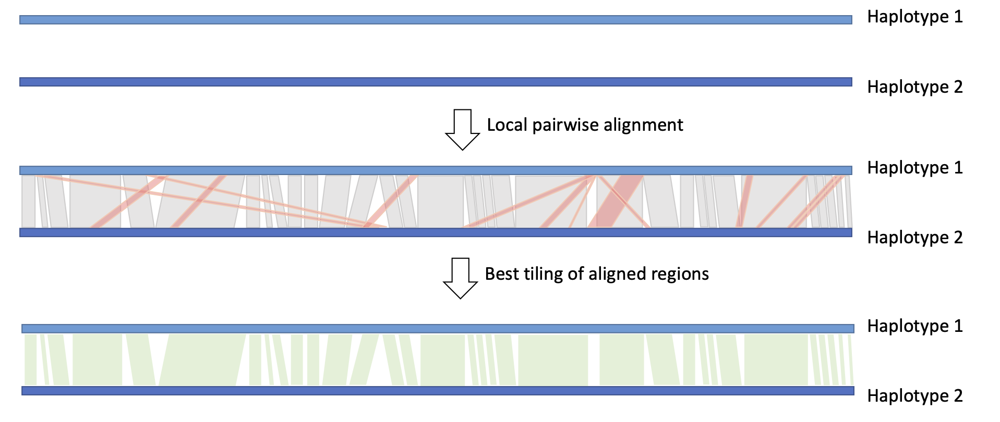

# 	HaploMap

HaploMap does a pairwise comparison between alternative haplotypes and generates a map of the co-linear regions.

```
usage: HaploMap.py [-h] [-f genome.fasta [Required]] [-c Hap1_to_Hap2.txt]
                   [--tmpdir /path/to/tmp] [-m [minimap|nucmer|blat]] [-t N]
                   [-o NAME]
```

## Input and Arguments

#### Mandatory

* `-f | --fasta`: Genome sequence in FASTA format.
  
  * Multiple files are accepted as a comma-separated list.
* `-c | —sequence_correspondence`: Tabular file(s) that relate pairs of sequences in different phases in this format:
    ```text
    Hap1_chr01   Hap2_chr01
    Hap1_chr02   Hap2_chr02
        [...]
    Hap1_chrNN   Hap2_chrNN 
    ```
  * Multiple files are accepted as a comma-separated list.

#### Optional

* `--tmpdir`: Path to temporary directory. 
  * Default: `./tmp_HaploMap`.
* `-m | --mapper`: Mapping tool to use.
  * Available tools:
    * `minimap` for minimap2.
    * `nucmer` for nucmer+show-coords.
    * `blat` for blat.
  * Default: `minimap`.
* `-t | --threads`:  Number of cores used in mapping process.
  * Default: `4`.
  * Ignored by `blat`, which will run a single core.
* `-o | --out`: Output files name prefix.
  * Default: `out`.

## Output

* `out.paired_regions.txt`: Tabular file reporting the corresponding coordinates of each collinear region between the paired sequences. Assuming that the sequence pair requested was: 

```Hap1_chr01 Hap2_chr01```

The format looks like:

* ```
  Hap1_chr01 4450    367901  Hap2_chr01 0       369778  358964  363451
  Hap1_chr01 405665  756715  Hap2_chr01 402962  757735  344425  351050
  Hap1_chr01 757031  791487  Hap2_chr01 758050  792489  34304   34456
  Hap1_chr01 797613  802669  Hap2_chr01 812258  817361  4691    5056
  [...]
  ```

* where the columns are:

  1. Hap1 ID
  2. Hap1 region start
  3. Hap1 region stop
  4. Hap2 ID
  5. Hap2 region start
  6. Hap2 region stop
  7. Number of matching based
  8. Alignment region length based on Hap1

## How it works

HaploMap will use minimap, nucmer or blat to do a whole sequence alignment of each pair of sequences reported in the `-c | —sequence_correspondence` input file.

Local alignments are analysed to identify the most probable bidirectional tiling path: the path that maximises the number of matching bases in both directions.

The best bidirectional tiling path is reported as a pairwise map of matching coordinates between phases.


