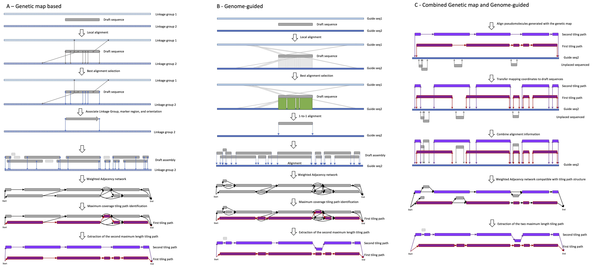

# HaploSplit

HaploSplit reconstructs pseudomolecules from a haploid or diploid draft assembly using collinearity with a reference genome as a guide.

## Usage

```
usage: HaploSplit.py [-h] [-i query.fasta [Required]] [--GFF3 genes.gff3]
                     [-a query.agp] [--input_groups input_groups.tsv]
                     [--legacy_groups legacy_groups.tsv] [-m markers_list]
                     [-n map.tsv] [-f] [--extended] [-g guide.fasta]
                     [-l local.paf] [-o NAME] [-p PREFIX] [--agp] [--fasta]
                     [--gapsize N] [--concatenate N] [--distance1 N]
                     [--distance2 N] [--align] [-t " --cs -x asm20 -r 1000"]
                     [-c N] [--hitgap N] [-e exclusion.tsv] [-k known.tsv]
                     [--alternative_groups alternative_groups.tsv] [--required_as_path]
                     [--R1 1st.txt] [--F1] [--min1 N] [--R2 2nd.txt] [--F2]
                     [--min2 N] [--B1 2nd.txt] [--B2 2nd.txt] [--N2] [-v]
                     [--skip_chimeric_qc] [--avoid_rejected_qc]
                     [--only_markers] [--haplodup] [--reuse_intermediate]
```

## Input and Arguments

#### Mandatory

   * `-i | --input query.fasta`: FASTA file of the input sequences
   * At least one of the following must be provided (sorted map of markers and/or a reference genome):
           * If the reconstruction is performed using a sorted map of markers:
                   * `-m | --markers markers_list`: Table of markers with map sorting position.
                           * Tab separated file with 3 columns: 
                                1. Chromosome ID
                                2. Marker sorting position
                                3. Marker ID
                   * `-n | --map map.tsv`: Map of marker positions on input sequences. 
                           * BED-like tab-separated file with 3 columns:
                                1. Sequence ID
                                2. Match start (0-based)
                                3. Match end (1-based)
                                4. Marker ID 
           * If the reconstruction is performed in genome-guided mode:
                   * `-g | --guide guide.fasta
                        `: Guide genome in FASTA format.
                   * `-l | --local_alignment local.paf`: PAF mapping file with local alignment hits of query sequences on guide sequences. If `--align` is set, the file will be created or overwritten, otherwise it will be used as input.
           * To perform an integrated reconstruction using both a map and a guide genome, use:
                   * `-m | --markers markers_list`, `-n | --map map.tsv` for the maps
                   * `-g | --guide guide.fasta
                        `, `-l | --local_alignment local.paf` for collinearity search
                   * Chromosome IDs must match in the map (`-m | --markers`) and genome files (`-g | --guide guide.fasta`)

#### Output and process control

* `-o | --out NAME`: Output file name prefix.
  * *default: out*.
* `-p | --prefix PREFIX`: Prefix for output sequence IDs.
  * *default: NEW*.
* `--agp`: Do not export result structures in AGP format.
* `--fasta`: Do not export results sequences in FASTA files.
* `--N2`: Don't run the search for the 2nd path.
* `-v | --dry`: Dry run: check marker uniqueness in input sequences. Produce a report of input chimeric sequences (if `--skip_chimeric_qc` is not set) and quit.
* `--skip_chimeric_qc`: Do not perform QC report on potentially chimeric input sequences.
* `--avoid_rejected_qc`: Avoid running the QC of the sequences assigned to a chromosome but not placed in the reconstructed pseudomolecule.
* `--only_markers `: Limit the QC of the unplaced sequences only to those that have markers.
  * *default: do not limit.*
  * If no marker information is provided, the option has no effect and all sequences will be QC’ed.
* `--haplodup`: Run HaploDup on assembly results. 
  * Set `--GFF3` to perform gene deduplication analysis with GMAP.
* `--reuse_intermediate`: Reuse the sequences and the intermediate results of a previous analysis and rerun just the plot.

#### Input sequence relationship information:

- `-e | --exclusion exclusion.tsv`: Tab-separated file of sequence pairs to avoid placing in the same haplotype.
  - Two columns reporting:
    1. sequence 1 ID
    2. sequence 2 ID
- `-k | --known known.tsv`: Tab-separated file of sequences known to be in the same haplotype. 
  - Two columns reporting:
    1. sequence ID
    2. association group ID
- `--alternative_groups alternative_groups.tsv`: Tab separated file with groups of sequences that should be in alternative haplotypes. 
  - Two columns with comma-separated lists
- `--required_as_path`: Manage lists in `--R1` and `--R2` as pre-computed tiling paths.
  - Alignment on the genome sequences will not be performed independently. Instead, they will be aligned together in a single pseudomolecule. Then, the sequences will be assigned a position based on their required order and orientation.
  - Other sequences are permitted in the tiling path if compatible with the given structure (i.e are in the gaps and don't overlap any of the required sequences)
- `--R1 1st.txt`: Require the following list of (stranded) contigs in the first haplotype. See [List files format]()
- `--F1 | --forcemarkers1`: Forces using only the markers in accordance with chromosome and direction reported in `--R1`
- `--min1 N`: Minimum length of sequence allowed for the first haplotype (*default: 0*)
- `--R2 2nd.txt`: Require using the following list of (stranded) contigs in the second haplotype. See [List files format]()
- `--F2 | --forcemarkers2`: Force using only the markers in accordance with chromosome and direction reported in `--R2`
- `--min2 N`: Minimum length of sequence allowed for the second haplotype (*default: 0*)
- `--B1 | --blacklist1 2nd.txt`: Blacklisted (stranded) contigs NOT to be used in the first haplotype. See [List files format]()
- `--B2 | --blacklist2 2nd.txt`: Blacklisted (stranded) contigs NOT to be used in the second haplotype. See [List files format]()
- `--N2`: Don't run the search for the 2nd path


##### List files format

Files with control lists per chromosome are in tabular format with 2 columns containing:

1. ID of the reference sequence to control
2. Comma-separated list of oriented draft sequences in the following format (`seq_id|direction`):

* Chromosome IDs must match the genome map IDs and/or the guide genome IDs

* Ex: 

  ```text
  chr01   
  chr02   seq660|+,seq677|-,seq683|-,seq1044|+,seq270|-
  chr03   seq1577|-,seq1572|-,seq2331|+,seq225|+
  chr04   seq135|-,
  ```


#### Other options

* `--GFF3 genes.gff3`: Annotation in GFF3 format

* `-a | --input_agp query.agp`: AGP file of input sequence structure and composition

* `--input_groups input_groups.tsv`:  Tab-separated file of associated groups of input sequences.

  * Two columns reporting the 
    1. sequences ID
    2. association group id
  * Sequence can be associated to multiple groups with multiple rows. 
  * If not provided, [`-e | --exclusion`] and [`-k | --known`] will be used for grouping. To force the usage of alignment hits, use "0" (zero) as value

* `--legacy_groups legacy_groups.tsv`: Tab-separated file associating components of the input sequences (must match IDs reported in `-a | --input_agp`). Two columns reporting the component ID and the association group it belongs to. Sequence can be associated to multiple groups with multiple rows.

* `-f | --filter`: If set, remove sequences with intra-sequence marker duplication from the analysis. [*Default: filter markers only, keep all sequences*]

* `--extended`: Extend the association of a sequence to all markers belonging to the same chromosome regardless of sequence orientation. [*Default: only the markers in the expected orientation are considered for tiling analysis*]

* `--gapsize N`: Minimum gap size of placeholders for AGP and FASTA (in bp) [*default: 1,000bp*]

* `--concatenate N`: If set, use N bp as gap size to concatenate unplaced sequences into one sequence (i.e. Chromosome Unknown) [*default: do not concatenated*]

* `--distance1 N`: Set the maximum distance (bp) between sequence projections on the guide genome to be considered adjacent in the same tiling path alignment for Hap1 [*default: 2,000,000bp*]

* `--distance2 N`: Set the maximum distance (bp) between sequence projections on the guide genome to be considered adjacent in the same tiling path alignment for Hap2 [*default: 4,000,000bp*]

* `--align`: Run mapping [*overwrite input file.paf if existing*]

* `-t | --tool " --cs -x asm20 -r 1000"`: Mapping command for minimap2. Parameters must be defined within single or double quotes

* `-c | --cores N`: Cores used in mapping process [default: 4]

* `--hitgap N`: Allowed  maximum distance (in bp) between local alignment hits to be merged in the same global alignment. [*default: 100,000bp*]

  

## Output

* `${ouput_name}.1.agp`, `${ouput_name}.2.agp`, `${ouput_name}.Un.agp`: AGP file defining draft pseudomolecule sequence relationships. See the [AGP file format specifications](https://www.ncbi.nlm.nih.gov/assembly/agp/AGP_Specification/).

* `${ouput_name}.1.list`, `${ouput_name}.2.list`, `${ouput_name}.Un.list`: sorted and directed list of draft sequences in the tiling path used to build pseudomolecules.
  
  * Tabular format with 2 columns containing:
    1. id of the tiled reference sequence
    2. comma-separated list of oriented draft sequences, reported as `seq_id|direction`.
    * Ex.: 
      ```text
      chr01   
      chr02   seq660|+,seq677|-,seq683|-,seq1044|+,seq270|-
      chr03   seq1577|-,seq1572|-,seq2331|+,seq225|+
      chr04   seq135|-,
      ```
  
* `${ouput_name}.1.fasta`, `${ouput_name}.2.fasta`, `${ouput_name}.Un.fasta`: Pseudomolecules sequences in FASTA format.

* `${ouput_name}.unplaced_to_pseudomolecule.txt`: Table reporting the known relationship of unplaced sequences to pseudomolecules and, eventually, of existing conflicts based on input sequences' association information.

* `${ouput_name}.conflicting_pseudomolecules.txt`: Table reporting existing conflicts between pseudomolecules based on input sequences' association information.

* `${ouput_name}.unused_sequences.list`: Table of sequences associated to a chromosome but not placed in any pseudomolecule tiling path.

#### Depending on input information:

* if `-a | --input_agp` is set, `${ouput_name}.legacy_structure.agp` will be produced to report the input sequence structure information directly to the output pseudomolecules. 
  * For example, if the input sequences are scaffolds and `-a | --input_agp` report the contig composition of the input, `${ouput_name}.legacy_structure.agp` will report the pseudomolecule structure based on the contig composition.
* if ` --align` is set:
  * `file.paf`: Minimap2 PAF alignment file.
* if ` --GFF3 ` is set: 
  * `${ouput_name}.annotation.gff3`: The annotation translated onto pseudomolecules sequences.
  * `${ouput_name}.broken_genes.txt`: Control file for annotation translation procedure. No gene locus will be altered in the process because HaploSplit does not edit input sequences.
  * `gene_ids.multiple_copy.txt`: will report any gene that has been used multiple times in the assembly
* if assembly has been performed using markers (`-n | --map`):
  * `${ouput_name}.markers.bed`: BED file with translated coordinates of the input markers on the output sequences
  * `${ouput_name}.unreliable_sequences.txt`: List of the sequences for which the location and/or orientation are unreliable due to ambiguity in the marker information
  * `${ouput_name}.missing_orientation.hap1.txt` , `${ouput_name}.missing_orientation.hap2.txt`: list of sequences that could be used to build the pseudomolecule but for which the correct orientation is unknown. These sequences are designated on the plus (+) strand in the files and may need a manual review.
  * `${ouput_name}.marker_blocks.txt`: Table reporting the results of the marker hits cleaning. For each sequence, there is a list of good markers (<=2 copies) that associate it to a chromosome and its orientation. The longest one is used during the pseudomolecule building procedure.
    
  
* if `--haplodup` is set:

  * `${ouput_name}.HaploDup_dir`: Directory with all the results of HaploDup analysis on the assembled sequences. See [HaploDup usage](HaploDup_usage.md) for details.
    * Results can be navigated in a browser using `out.HaploDup_dir/index.html`
    * Plot contents depend on the available input information.
    * If a guide genome has been used, the results will also report the comparison of the assembled haplotypes against it
  * if `--avoid_rejected_qc` is not set, a directory called `${ouput_name}.structure_comparison` is created to contain the comparisons of structures to a chromosome but remained unplaced. See [HaploDup usage](HaploDup_usage.md) for details.
    * Results can be navigated in a browser using `${ouput_name}.structure_comparison/index.rejected_sequences.html` 
* If `--skip_chimeric_qc` is not set and duplicated sequence markers are detected: 

  * `${ouput_name}.input_sequence_QC`: Directory with the reports of each input sequence with duplicated marker content
    * Results can be navigated in a browser using `${ouput_name}.map_genome_order.input_sequence_QC/index.sequence_duplication_QC.html`
    * For more information on the plots, see [Input sequences reports](../Workflows/input_QC.md)

#### Temporary files:

* `tmp.query.fasta.for` and `tmp.query.fasta.rev`: Query sequences, forward and reverse complement.
* `tmp.file.paf.for`, `tmp.file.paf.rev`, `tmp.file.paf.multimapping`, `tmp.file.paf.multimapping.uniq`: intermediate alignment files, forward only, reverse complement only, both, and best 1-to-1 path.
* `${ouput_name}.marker_cleaning_tmp`: Results of marker QC and input sequence orientation assignment

## How it works



HaploSplit uses external sources of information to assign the draft assembly sequences to given linkage groups, sort, orient, and scaffold them obtaining a diploid representation of each chromosome through one sequence for each haplotype.

HaploSplit can be run using 3 different approaches according to information provided for chromosome assignment:

- Genetic map based:
  - This approach requires the use of a genetic map and the identification of marker positions on draft sequences. 
  - Markers' order in the map of each chromosome are used to sort draft sequences into two pseudomolecules.
  - Markers are considered only if present once in a given haplotype:
    - Markers that hit the draft sequences >2 times are automatically removed from the computation
    - When both marker copies hit the same draft sequence, a QC report is generated to investigate misassembly. See [Input Sequence QC](../Workflows/input_QC.md) for more details on how to interpret the results.
  - Markers may not be able to orient all the given sequences (ex. draft sequences with a single marker). HaploSync will (1) try to recover the information by comparing the two sequences bearing the same marker. (2) If recovery fails, HaploSplit will use the un-oriented sequence and report the ambiguity.
- Guide genome based:
  - Pseudomolecule reconstruction is performed by sorting and orienting the draft sequences based on their collinearity with a chromosome-scale guide genome.
  - Draft sequences that are collinear to the same region of the guide genome (alignment projections on it overlap) are considered as alternative and are not allowed in the same haplotype
  - An ideal guide genome should be as structurally similar as possible. Since only homolog regions' projections are used to define the alternative sequences, misalignments due to sequence structure divergence may not allow proper haplotype separation.
    - [HaploDup](HaploDup_usage.md) quality control is most important in this case because it will show erroneous within-haplotype duplications.
- Combined information:
  - A genetic map and a guide genome are both available
  - Pseudomolecules are reconstructed using the genetic map first. If any sequence used in the tiling path is still unoriented, orientation will be assigned according to homology with the guide genome.
  - Tiling paths are mapped against the guide genome and the relative position of each draft sequence is assigned accordingly.
  - Unassigned draft sequences are mapped on the guide genome and assigned to the most similar sequence
  - Tiling paths are updated with unplaced sequences that are compatible with the map-defined structure (no overlap of collinear regions' projection, allowing unplaced sequence to fill a gap)
