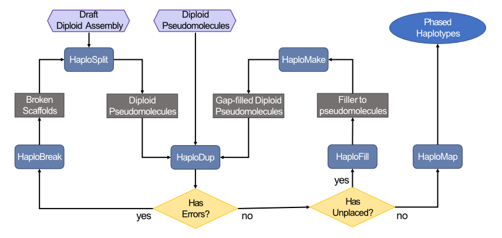

# Workflows

## Workflow diagram

## Workflow steps

[1 - Generate diploid pseudomolecules with HaploSplit](generate_pseudomolecules.md).

[2 - Pseudomolecule quality control.](pseudomolecule_QC.md)

[3 - Manipulate genomic sequences with HaploBreak and HaploMake](edit_sequences.md).

[4 - Improve pseudomolecules by filling gaps](fill_and_make.md).

[5 - Phase haplotypes](map_and_phase.md).

## Workflows

### Draft to phased pseudomolecules

1. Perform input QC and generate a first set of pseudomolecules using HaploSplit ([1 - Generate diploid pseudomolecules with HaploSplit](generate_pseudomolecules.md))
   * 1.a: If input sequences need editing, you may want to correct them first ([3 - Manipulate genomic sequences with HaploBreak and HaploMake](edit_sequences.md)), then return to step 1 to produce corrected pseudomolecules.
2. Perform a QC of the assembly results with HaploDup ([2 - Pseudomolecules quality control.](pseudomolecule_QC.md)). According to the results, you may need to: 
   * 2.a: correct the input sequences ([3 - Manipulate genomic sequences with HaploBreak and HaploMake](edit_sequences.md)) and perform step 1 again ([1 - Generate diploid pseudomolecules with HaploSplit](generate_pseudomolecules.md)) .
   * 2.b: update the constraints between sequences using previously unknown haplotype-to-haplotype relationships and perform step 1 again ([1 - Generate diploid pseudomolecules with HaploSplit](generate_pseudomolecules.md)) .
3. Improve the assembly information by filling gaps with HaploFill ([4 - Improve pseudomolecules by filling gaps](fill_and_make.md).)	
4. Perform a QC of the assembly results with HaploDup ([2 - Pseudomolecules quality control](pseudomolecule_QC.md)). According to the results, the procedure may require the following:
   * 4.a: if errors are present in the scaffolds, correct the input sequences ([3 - Manipulate genomic sequences with HaploBreak and HaploMake](edit_sequences.md)), then return to Step 1 to produce corrected pseudomolecules.
   * 4.b: update the constraints between sequences using previously unknown haplotype-to-haplotype relationships and perform step 1 again ([1 - Generate diploid pseudomolecules with HaploSplit](generate_pseudomolecules.md)) .
   * 4.c: further improve the assembly by re-iterating step 3, HaploFill ([4 - Improve pseudomolecules by filling gaps](fill_and_make.md).)	
   * 4.d: if the the results are satisfactory, process the results with HaploMap to extract the phasing information map ([5 - Phase haplotypes](map_and_phase.md)).

### Pseudomolecule QC and improvement

1. Perform a QC of the assembly results with HaploDup ([2 - Pseudomolecules quality control.](pseudomolecule_QC.md)). According to the results, you may need to:
   * Correct the sequences:
     1. correct the input sequences ([3 - Manipulate genomic sequences with HaploBreak and HaploMake](edit_sequences.md))
     2. perform HaploSplit ([1 - Generate diploid pseudomolecules with HaploSplit](generate_pseudomolecules.md))
     3. return to step 1 and perform a QC of the assembly results with HaploDup ([2 - Pseudomolecules quality control.](pseudomolecule_QC.md)). 
   * Improve the assembly information:
     1. Fill gaps with HaploFill ([4 - Improve pseudomolecules by filling gaps](fill_and_make.md).)	

2. Perform a QC of the assembly results with HaploDup ([2 - Pseudomolecules quality control](pseudomolecule_QC.md)). According to the results, the procedure may require the following:
   * if errors are present in the scaffolds, correct the input sequences ([3 - Manipulate genomic sequences with HaploBreak and HaploMake](edit_sequences.md)), then return to Step 1 to produce corrected pseudomolecules.
   * update the constraints between sequences using previously unknown haplotype-to-haplotype relationships and perform step 1 again ([1 - Generate diploid pseudomolecules with HaploSplit](generate_pseudomolecules.md)) .
   * further improve the assembly by re-iterating step 3, HaploFill ([4 - Improve pseudomolecules by filling gaps](fill_and_make.md).)	

3. If the the results are satisfactory, process the results with HaploMap to extract the phasing information map ([5 - Phase haplotypes](map_and_phase.md)).
