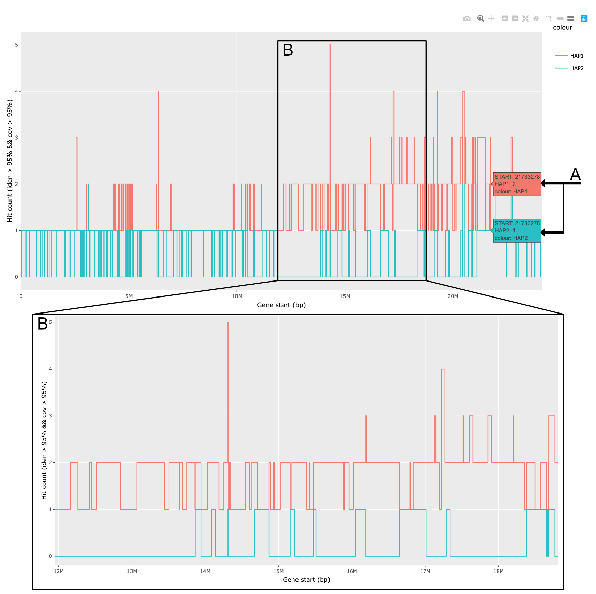
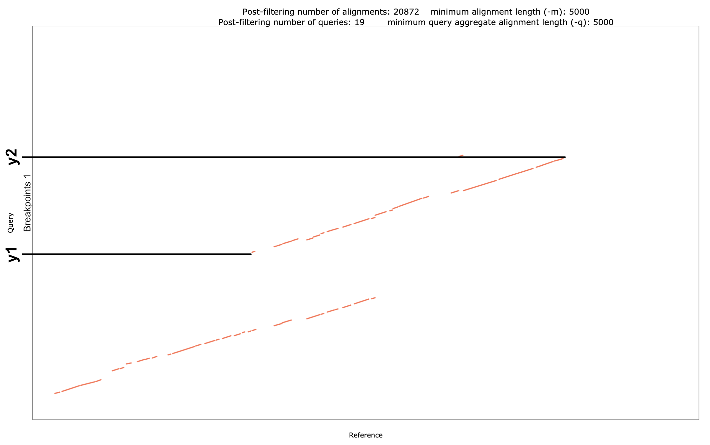
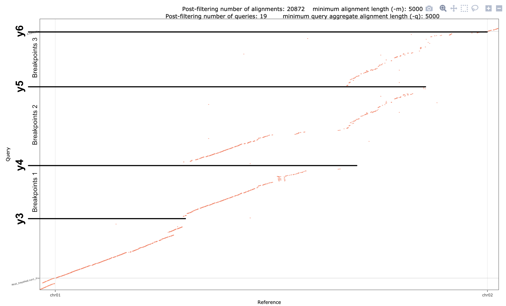

[<< Back | Workflows ::: Generate pseudomolecules and QC scaffolding errors](generate_pseudomolecules.md)

# Step 2: Quality control

A common issue that may arise during pseudomolecule diploid-aware assembly is the assignment of both copies of a genomic region to the same haplotype sequence. This may happen for 2 reasons:

* Draft assembly errors
  * We notice that some technologies may be fooled to join both haplotypes in the same scaffold when dealing with peculiar structural situation. Notably, optical maps showed to produce such kind of chimeric scaffolds (see [Minio et. al (2020)](ref) for an example) in grape related species, consistently in the same chromosomic arms for different species. We also observed similar results with HiFi reads and HiFiASM when delivering the longest primary assembly.
  * For optical maps, as they are used also in order to correct within-contigs haplotype switches, it is difficult to determine an optimal set of parameters or procedure to avoid the chimeric scaffolds. However, this errors are pretty easy to spot during the QC phase, as “duplications" involve large genomic regions.
* Local-to-global alignment conversion in HaploSplit underestimating the real boundaries of the global alignment
  * Local-to-global alignment conversion requires to connect multiple small local hits into a single path. To do so the gap size allowed between hits to define them as adjacents is critical. If it is set too small, paths may cover just a fraction of the overlapping region when query and reference species are too distant. On the contrary, if set too large, specious hits from repetitive regions falling far apart may be considered valid, generating extremely large overlapping regions.
  * Sequences that are allowed to be in the same tiling path must do not have overlapping alignment regions on the reference. So:
    * If large gaps between local alignments are allowed, the overall mapping region of the draft sequence may extend on an anormally large region on the reference because of very distant hits (repetitive regions...). If this happen, many draft sequences may have overlapping projections on the reference, therefore those will all be considered incompatible and not allowed to lie on the same haplotype. Many sequences will have no place to go and end up in the unplaced because of the projection inflation.
    * If the size of the allowed gaps is too short, it won't be able to encompass the SVs between haplotypes, therefore the projection of the draft on the reference will be partial and missing one extremity. In this situation, sequences that are actually overlapping will not be considered incompatible as their projection do not overlap. This leads both alleles of the same region to end in the same haplotype instead of separating them.
  * Blacklisting the sequence for allows to correct HaploSplit behaviour while building the tiling paths.

Quality control of the assembly involves comparing the duplication information of the assembly-to-reference dotplot and inspect the gene content counts. 

Dotplot gives an easy way to identify eventual duplications in the sequence by double matching regions of the query over the reference. However, as reference-based information, anything diverging from the expected structure will show up, even real segmental duplication. 

Gene multiplicity count is reference independent, as comparison is performed between haplotypes directly. It has a lower resolution, bound to the gene density on the genome, however it allows to distinguish real whole genome duplication from errors by consistency in the gene counts across haplotypes.

## 2.1 - Search dotplots for possible errors

Here is reported an example from the reconstruction of _M. rotundifolia_ genome for [Cochetel et al. (2020)](ref) as reported in [Minio et. al (2020)](ref). The chromosome 2 pseudomolecule of _M. rotundifolia_ (query, y axis) os aligned on PN40024 V2 genome (Reference, x axis).  


The box :a: and :b: in the figure evidence the presence of regions where a possible or probable duplication event had happened. Using the information that hit labels report (**C**) when a hit is hovered in the interactive HTML dotplot. This information is very useful as the legend reports the coordinates of the matching region on both sequences, Qstart and Qstop with respect to the query genome (i.e. Y axis), Tstart and Tstop to the reference one (Target, i.e. X axis). This allows to easily trace the boundaries of the issues and, later, select the breakpoint positions.

In this phase, we take notes of the regions coordinates and check the gene copy number in HaploDup results to verify the the existing issues.

## 2.2 - Verify duplication by gene hit counts

Gene copy count plot shows, for each gene annotated on the sequence, how many copies are found in each haplotype. The interactive plot can show, when hovered, the count of hits for each haplotype in the label (A) and the coordinates of the gene locus start. This coordinates will reflect the Y coordinates on the corresponding sequence dotplot aginst the reference. If [“Compare data on hover” is selected](Screenshot%202020-06-23%20at%2013.40.27-2944915.png), both haplotype labels are shown at same time.



The regions selected in step 2.1 are candidate for breakpoint selection, but we need first to clarify if the duplication event seen is really due to an error, in order to not overfit the guide sequence structure. 

In the box B we enlarged a portion of Hap1 within the a region of interest. It is clear that most of the genes in this large region (6Mbp) are represented in two or more copies within the same pseudomolecules of haplotype 1 (red line) while entirely missing on haplotype 2 (blue line). Situation like this confirm that the region is subject to an erroneous sequence duplications and we must proceed with a proper breakpoint selection.

While segmental duplication can have occurred with respect to the reference genome, which would lead to a similar double matching line on the dotplot, it is extremely unlikely that it could have happened concurrently to an identical deletion of the alternative haplotype. In case of segmental duplications it is more likely that a) both haplotypes show the same duplication (bilateral), b) only one of the two haplotypes has undergone duplications. In either case, however, haplotype 2 should show similar gene content with, at least, one copy of the genes. In the picture above instead, in most of the situations genes in multiple copies in Hap1 correspond no gene copy detection in Hap2, a situation that is more likely to be an assembly error.

## 2.3 - Define breakpoints

After having verified that the suspicious duplications are in fact errors, we can go back to the dotplots to define the breakpoints needed to correct the assembly issues

* :a: : small overlap between the extremities of adjacent regions. This is the typical resemblance of a HaploSplit error in not segregating sequences insisting on the same genomic region (see "Local-to-global” above) if the gene content do not exclude a segmental duplication.

  In such a situation, selecting breakpoints around one of the two sequences will drive HaploBreaker to blacklist that sequence for that haplotype, forcing the segregation in two different tiling paths.
  

  In the breakpoints file, for correspond reference sequence id (chr02), we’ll add a breakpoint pair with the coordinates of **y1** and **y2**. Approximates are sufficient, HaploBreak takes care of finding the proper gap to break.
  Ex: Assuming that **y1** and **y2** coordinates are respectively ~1Mbp and ~1.5Mbp, we’ll add a line to breakpoints file `Breakpoints.txt` like:
  
  ```text
  chr02	1000000-1500000
  ```
* :b: : Duplication of a large portion of the sequence. This is the way a scaffolding artefact looks like. In this specific case it is due to the HybridScaffolding of PacBio build sequences and BioNano Optical Maps, a situation that we observed to be consistent across different species in the same chromosome region but also using other sequencing technologies (ex. HiFi). The peculiar structure of the region leads the assembler to concatenate both haplotypes in the same scaffold, but given the size is quite easy to spot.

  In such a situation, breakpoints should be designed around each copy. HaploBreaker will take care of finding the gap in the scaffold structure that do break the different haplotype copies apart.
  

  In the breakpoints file, for the corresponding reference sequence id (chr02), we’ll add 3 breakpoint pairs, one from **y3** coordinates to **y4**, the second from **y4** to **y5** and the third from **y5** to **y6**. Approximate coordinates are is enough, HaploBreak takes care of finding the proper gap to break. 

  Ex: Assuming that **y3**, **y4**, **y5** and **y6** coordinates are respectively ~12Mbp and ~17Mbp, ~25Mbp, and ~30Mbp, we'll add them to the chr02 line of `Breakpoints.txt`, obtaining along with :a: breakpoints (y1 and y2):
  ```text
  chr02	1000000-1500000,12000000-1700000,17000000-25000000,25000000-30000000
  ```

* Keywords `START` or `BEGIN`, caps insensitive, can be used to indicate the begin go the sequence, `END` or `STOP`, caps insensitive, indicate the end of the sequence.

## Next step

According to the results of the QC, there are 2 possible situations:

1. No Issue has been found, there is no need to edit the pseudomolecules. **The assembly task completed.** If there are still unplaced sequences, it may be useful to proceed with [HaploMake to perform a gap-closing procedure](fill_and_make.md)

2. There are issues that do need correction by breaking the pseudomolecules. 

   Move on to **[Step 3 - Edit sequences](generate_pseudomolecules.step_3.md)**, run **[Step 4 - Build corrected pseudomolecules](generate_pseudomolecules.step_4.md)** and then come back to QC on the newly assembled sequences to validate the results.
