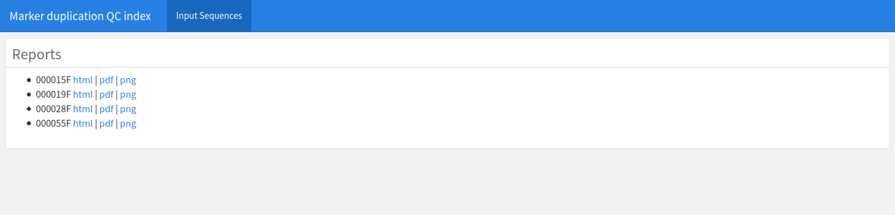
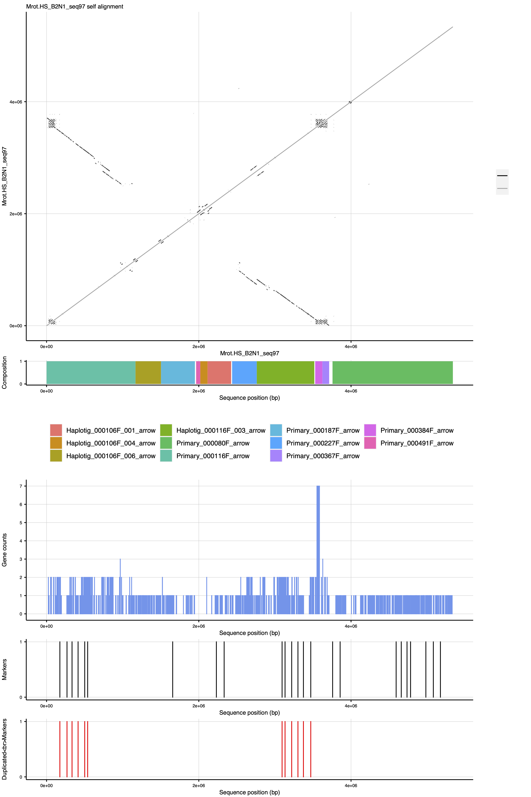

# 1.1 - Input Sequence Quality Control

HaploSync inherits assembly errors from the input sequences, so it is important to do a quality control procedure before pseudomolecule reconstruction.

HaploSplit automatically triggers the quality control analysis on input sequences that contain both copies of a genetic marker. Genetic information like marker or single copy genes are fundamental in this phase to distinguish errors from real segmental duplications. Markers are expected once in each haplotype. When two are present, it is a strong indication of an assembly error, though genes could belong to an expanding family and sequence copy number may be expanding locally.

For each suspected input sequence, a report is produced as an interactive HTML or single page PDF and PNG plots. These can be browsed in the QC folder (`index.sequence_duplication_QC.html`) 

The plot may change according to the available input information. If all information is present, it will look like:

Phased along the genome sequence, there are 5 traces:

1. Self alignment: DotPlot made in 1 Kbp windows. Sequence duplications will be visible.
2. Input sequence structure: structure of the input sequence based on the legacy assembly components. In the example, the input sequence is a Hybrid Scaffold made of the reported Falcon Unzip contigs.
3. Gene content self map copy number count: CDS of the annotated genes are mapped back on the sequence and mapping hits are counted. Duplicated regions will be visible for most genes with duplicated mapping counts 
4. Marker position: Position of the identified markers on the genome
5. Positions of duplicated markers: Markers that are present twice in the sequence are visible.

In the example above, the scaffold size is not unreasonably long and the segmental duplication (with inversion) may be real. However, marker count and sequence content support that an assembly error is present. All markers in the translocation are duplicated and in mirror orientation. In addition, the error is supported by the presence of a haplotig sequence concurrent with the primary it is associated with (Primary_000116F and Haplotig_000116F_003).
