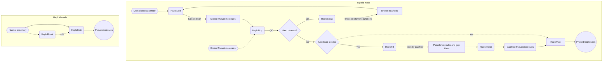

# HaploSync Diagram

## Mermaid

```mermaid
graph TD
	subgraph Diploid mode
		A{{Draft diploid assembly}} --> B(HaploSplit)
		A2{{Diploid Pseudomolecules}}  .-> J
		E -- Break on chimeric junctions --> F[Broken scaffolds]
  	K --> L((Phased haplotypes))
  	F --> B
  	I --> K
  	B(HaploSplit) -- Split and sort --> C[Diploid Pseudomolecules]
  	C --> J(HaploDup)
  	id2 -. no .-> K[HaploMap] 
  	id1 -- yes --> E(HaploBreak)
  	J -- QC --> id1{Has chimeras?}
  	id1 -- no --> id2{Need gap closing}
  	id2 -- yes -->  D(HaploFill)
  	D -- idenitfy gap filler --> G[Pseudomolecules and gap fillers]
  	G --> H(HaploMaker)
  	H --> I(Gapfilled Pseudomolecules)
	end
	
  subgraph Haploid mode
    A3{{Haploid assembly}} --> B3(HaploSplit)
    B3 --> C3((Pseudomolecules))
    A3  .-> D3(HaploBreak)
    D3 -. edit .-> B3
  end
```

