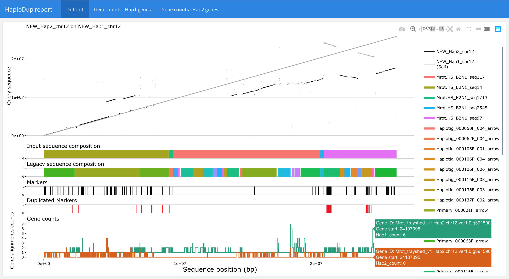
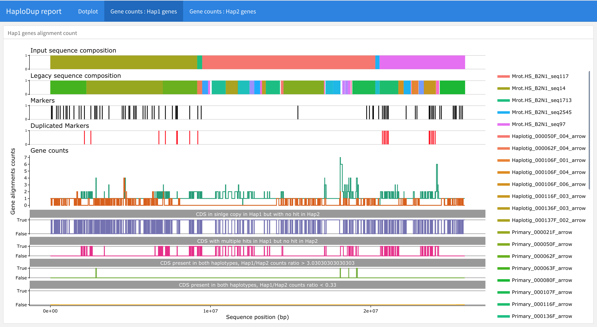
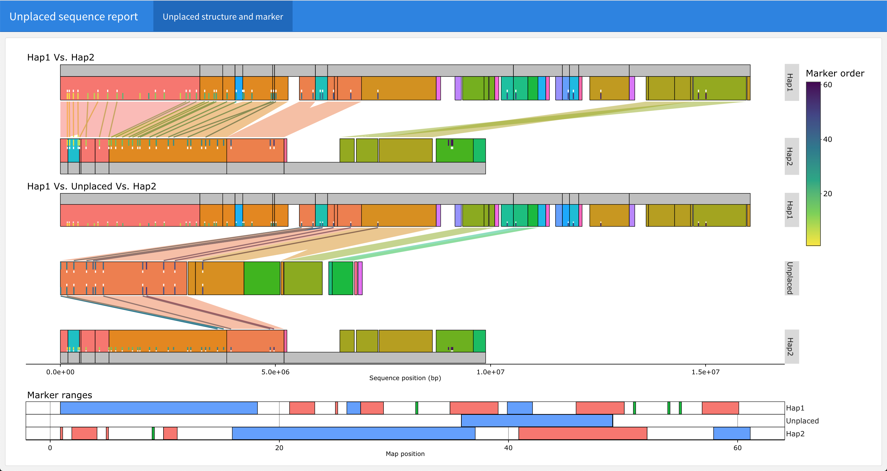
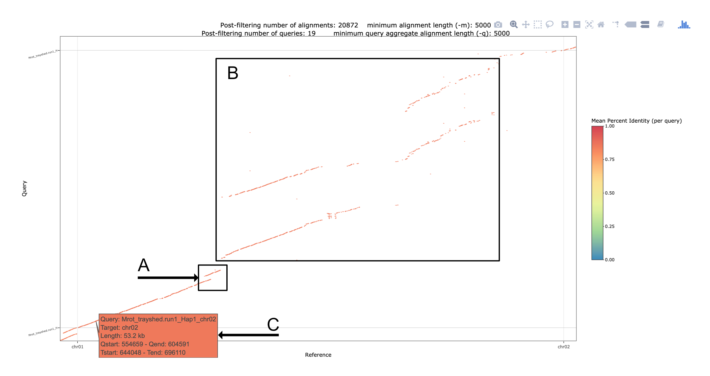
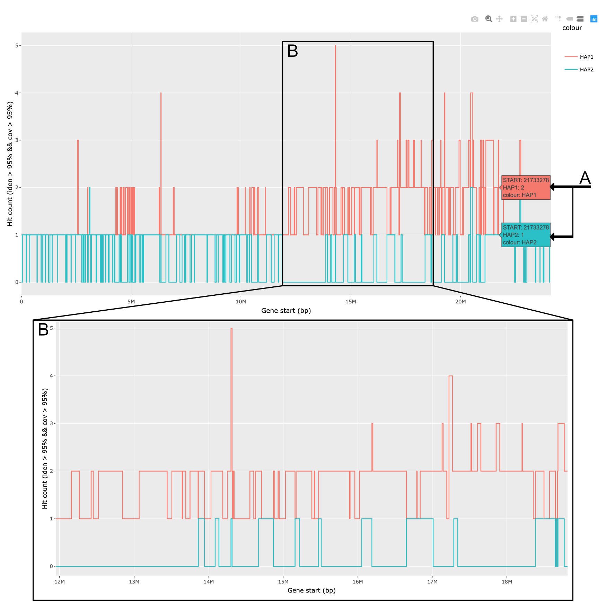
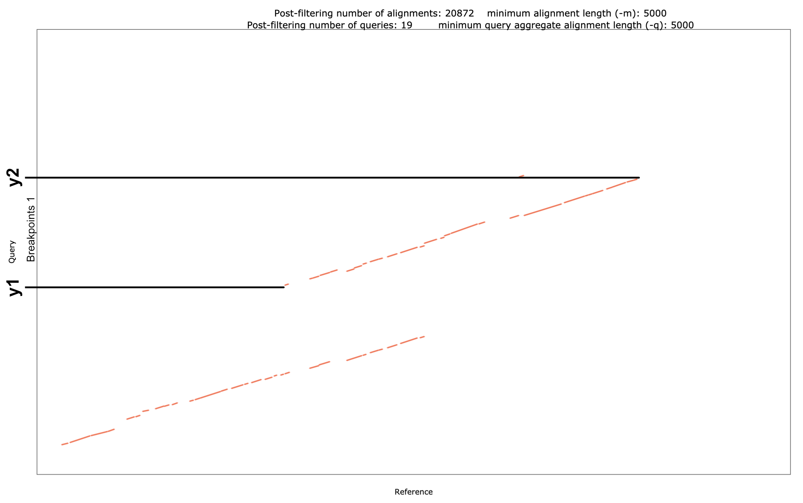
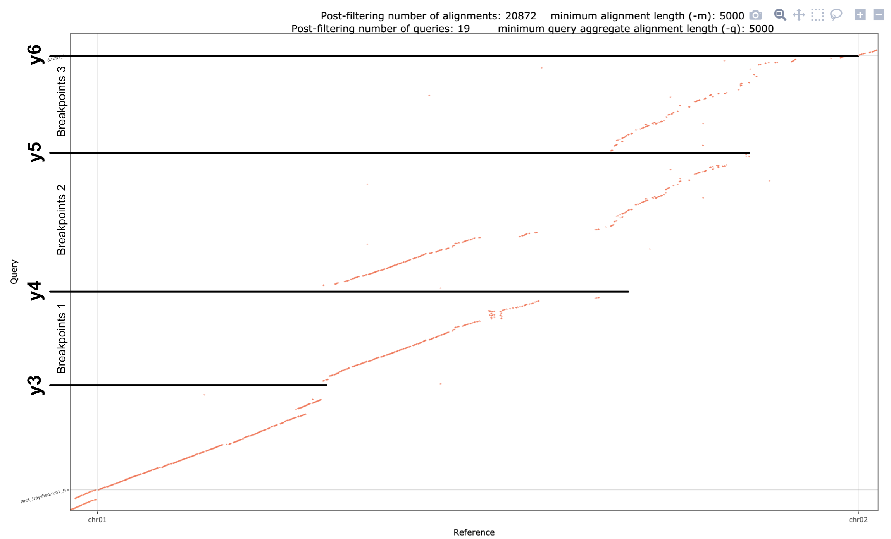

# 2 - Pseudomolecule Quality control

A common issue that may arise during diploid-aware pseudomolecule assembly is the assignment of both copies of a genomic region to the same haplotype sequence. This may happen for 2 reasons:

* Draft assembly errors
  * When using some technologies, like optical maps, HiFi reads, and HiFiASM, both haplotypes might be joined in the same scaffold under some circumstances (see [Minio et. al (2020)](ref) for an example).
  * Because optical maps are also used to _correct_ within-contigs haplotype switches, it is difficult to determine an optimal set of parameters to avoid creating chimeric scaffolds. However, these errors are easy to spot during the QC phase as “duplications" that involve large genomic regions.
* When HaploSplit uses a guide genome, local-to-global alignment conversion underestimates the real boundaries of the global alignment. This may due to:
  * SVs that do not permit imprecise or comprehensive location of the collinear region
  * Local-to-global alignment conversion requires connecting multiple small local hits into a single path. The gap size allowed between hits to define them as adjacent is critical. If the gap size is too small, paths may cover a fraction of the overlapping region when query and reference species are too distant. If the gap size is too large, specious hits from repetitive regions falling far apart may be considered valid, generating extremely large overlapping regions.

Quality control of the assembly uses its diploid nature to identify potential errors by comparing sequence information and finding suspicious places where a duplication in one pseudomolecules corresponds to a total loss of the other haplotype; it is unlikely that this is real / biologically correct.

HaploDup generates reports for each sequence, layering the information available to visualize suspicious regions. The higher the quality of the information and the more global it is, the more informative the results.

Genomic markers that are global and unique in the genome, are the most informative kind of data. In a haploid representation of the genome, they should only exist once. In a diploid assembly, they should occur twice (once in each haplotype). Two or more copies of the same marker in the same haplotype is strong evidence of an assembly error. The duplication can be confirmed using dotplots to exclude false marker hits.

Dotplots and gene hit number are very useful, but exercise caution when using this information alone. Errors might be over-estimated when genes are not globally unique. Dotplots make it easy to visualize duplications in the query relative to the reference. A comparison between the two haplotypes makes sure that the duplicated regions do not originate with a segmental duplication in a single haplotype. 

The gene copy count is reference independent and the comparison is done between haplotypes directly. It has relatively low resolution due to gene density in the genome. 

In this workflow, we assume that `${HaploSync_path}` is set and points to the installation directory for HaploSync. To do this, run:

```bash
export HaploSync_path="/path/to/HaploSync"
```

## 2.1 - Run HaploDup

```bash
${HaploSync_path}/HaploDup.py \
	-f ${input_fasta} \
	-g ${input_gff3} \
	-b ${input_markers_hits_bed} \
	--markers_map ${input_map_tsv} \
	-c ${correspondance_txt} \
	--agp ${input_agp} \
	--legacy_agp ${input_legacy_structure_agp} \
	--legacy_groups ${input_legacy_groups_tsv} \
	--rejected_list ${unplaced_to_check_tsv} \
	-o ${out_dir_name} \
	-t ${core}
```

where:

* `${input_fasta}`: 
* `${input_gff3}`: 
* `${input_markers_hits_bed}`: 
* `${input_map_tsv}`: 
* `${correspondance_txt}`: 
* `${input_agp}`: 
* `${input_legacy_structure_agp}`: 
* `${input_legacy_groups_tsv}`: 
* `${unplaced_to_check_tsv}`: 
* `${out_dir_name}`: 
* `${core}`: 
* See [HaploDup usage page](../Usage/HaploDup_usage.md) for a complete list of options and a description of the procedure.

## 2.2 - Navigating the results

HaploDup 

* `${NAME}.dedup_dir`: Analysis of the pseudomolecule structures. It contains several files that can be navigated on a browser using:
  * `index.html`: This file can be opened in a web-browser to navigate all report files.
* `${NAME}.structure_comparison`: If `--rejected_list` is given, this folder will contain the reports from the comparison of unplaced sequences.
  * `index.rejected_sequences.html`: This file can be opened in a web-browser to navigate report files

## 2.3 - QC reports

### 2.3.1 - Pseudomolecules QC report

Plots can be viewed in a web browser and navigated from `${NAME}.dedup_dir/index.html`. Reports include interactive HTML plots and single PDF and PNG plots for each pseudomolecule. Each report will contain:

* An alignment of the query sequence on the target sequence, super-imposed on the alignment of the target pseudomolecule on itself
* The target sequence structure, with two lines of sequences at most
* Marker position and duplication status
* Gene mapping count on both haplotypes
* Unbalanced gene mapping count between haplotypes





### 2.3.2 - Unplaced sequence rejection QC report

Reports can be viewed as interactive HTML plots or in individual PDF or PNG pages from `${NAME}.structure_comparison/index.rejected_sequences.html`. Plot content depends on the available input. It generally contains:

* A comparison of associated pseudomolecules structures in terms of markers and sequence content at two structural levels (ex. scaffolds input to HaploSplit and their composition in terms of legacy contigs).
* Comparison of the unplaced sequence with the associated pseudomolecules in terms of markers and sequence content at two structural levels (ex. scaffolds input to HaploSplit and their composition in terms of legacy contigs).
* Marker content usage comparison



## 2.4 - Search dotplots for possible errors

The following example shows errors caused by previous scaffolding procedures and a guide-genome.



* :a: : small overlap at the ends of adjacent regions. When gene content does not support that a segmental duplication occurred, this is how a HaploSplit error would typically look; it does not segregate sequences and instead places them in the same genomic region.
* :b: : Duplication of a large portion of the sequence. This is what a scaffolding artefact looks like. This specific case is caused by Hybrid Scaffolding PacBio build sequences and BioNano Optical Maps. This occurs across different species in the same chromosome region and using other sequencing technologies (ex. HiFi). The peculiar structure of the region leads the assembler to concatenate both haplotypes in the same scaffold. Given its size, it is easy to identify.

Boxes :a: and :b: in the figure show where duplication events likely happened. AV NOTE: ANDREA, YOU WANTED TO REVISE HERE!

The legend reports the coordinates of matching regions on both sequences with respect to the query genome (Qstart and Qstop; Y axis) and the reference (Tstart and Tstop; X axis). You can trace their boundaries and select breakpoint positions later.

In this phase, we note the region coordinates and check the gene copy number in HaploDup results to verify the existing issues.

## 2.5 - Verify duplication by gene hit counts

The gene copy count plot shows how many copies are found in each haplotype for each gene annotated on the sequence. The interactive plot can show the count of hits for each haplotype in (A) and the coordinates of the gene locus start. These coordinates will reflect the Y coordinates on the corresponding sequence dotplot aginst the reference. If [“Compare data on hover” is selected](./hover.png)), both haplotype labels are shown at same time.


The regions selected in step 2.1 are candidates for breakpoint selection. However, first we must confirm whether the duplication event is due to an error so that the guide sequence structure is not overfit.

In box B, we enlarged a portion of Hap1 within a region of interest. It is clear that most of the genes in this large region (6Mbp) are represented twice or more within the same haplotype 1 pseudomolecules (red line) and missing in haplotype 2 (blue line). This confirms that the region contains erroneous sequence duplications and we must proceed with breakpoint selection.

Though a segmental duplication may have occurred relative to the reference genome, which would lead to a similar, double-matching line on the dotplot, it is extremely unlikely that it could have happened concurrently with an identical deletion in the alternative haplotype. It is more likely that a) both haplotypes show the same duplication (bilateral) or b) only one of the two haplotypes has undergone duplications. In either case, however, haplotype 2 should show similar gene content with and contain at least one copy of the genes. In the picture above, most duplicated genes in Hap1 correspond to no gene copy in Hap2. This is likely an assembly error.

## 2.6 - Define breakpoints for HaploBreak

After verifying that the suspicious duplications are errors, we return to the dotplots to define the breakpoints needed to correct the assembly issues.

* :a: : small overlap at the ends of adjacent regions. When gene content does not support that a segmental duplication occurred, this is how a HaploSplit error would typically look; it does not segregate sequences and instead places them in the same genomic region.

  In this scenario, selecting breakpoints around one of the two sequences will drive HaploBreak to blacklist that sequence for that haplotype, forcing the sequences in two different tiling paths.
  

  In the breakpoints file, we’ll add a breakpoint pair with the coordinates of **y1** and **y2** that correspond to the reference sequence (chr02). Approximate positions are sufficient. HaploBreak will try to find a proper gap to break.
  Ex: Assuming that **y1** and **y2** coordinates are respectively ~1Mbp and ~1.5Mbp, we’ll add a line to breakpoints file `Breakpoints.txt` like:

  ```text
  chr02	1000000-1500000
  ```

* :b: : Duplication of a large portion of the sequence. This is what a scaffolding artefact looks like. This specific case is caused by Hybrid Scaffolding PacBio build sequences and BioNano Optical Maps. This occurs across different species in the same chromosome region and using other sequencing technologies (ex. HiFi). The peculiar structure of the region leads the assembler to concatenate both haplotypes in the same scaffold. Given its size, it is easy to identify.

  In such a situation, breakpoints should be designed around each copy. HaploBreaker will take care of finding the gap in the scaffold structure that do break the different haplotype copies apart.
  

We’ll add 3 breakpoint pairs in the breakpoints file, one from **y3** to **y4**, another from **y4** to **y5** and a third from **y5** to **y6**.

  Ex: If the coordinates of **y3** and **y4** are ~12Mbp and ~17Mbp and **y5** and **y6** are  ~25Mbp and ~30Mbp, we'll add them to the chr02 line of `Breakpoints.txt` after breakpoints **y1** and **y2**.

  ```text
  chr02	1000000-1500000,12000000-1700000,17000000-25000000,25000000-30000000
  ```

* Keywords `START` or `BEGIN`, case insensitive, indicate the beginning of the sequence. `END` or `STOP`, case insensitive, indicate the end of the sequence.

## Next step

According to the results of the QC, there are 2 possible situations:

* If no problem is found, there is no need to edit the pseudomolecules. **The assembly task completed.** If there are still unplaced sequences, it may be useful to proceed with [HaploMake to perform a gap-closing procedure](fill_and_make.md)

* If there are issues that do need correction by breaking the pseudomolecules: 

  1. Edit the input sequences to solve assembly issues ([3 - Manipulate genomic sequences with HaploBreak and HaploMake](edit_sequences.md))

  2. Rebuild pseudomolecules from corrected sequences ([1 - Generate diploid pseudomolecules with HaploSplit](generate_pseudomolecules.md))
  
  3. QC the newly assembled sequences to validate the results.
